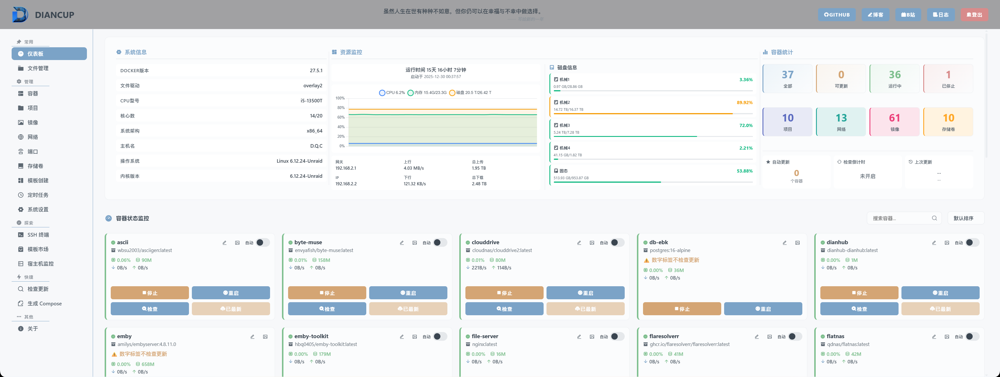
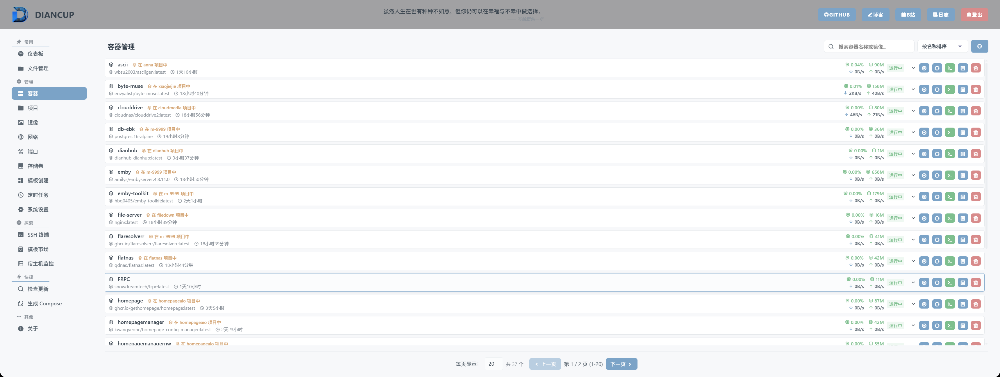
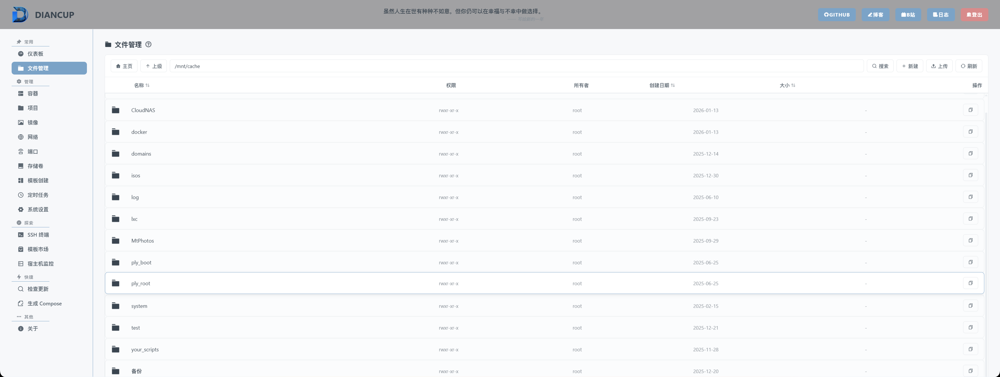
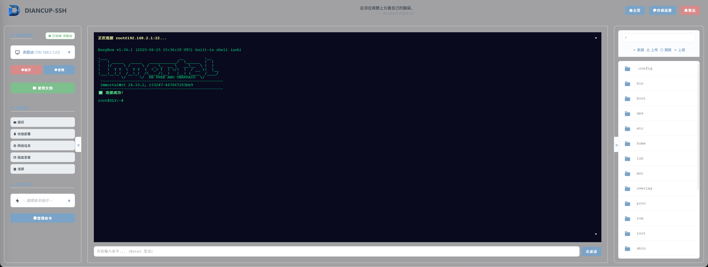
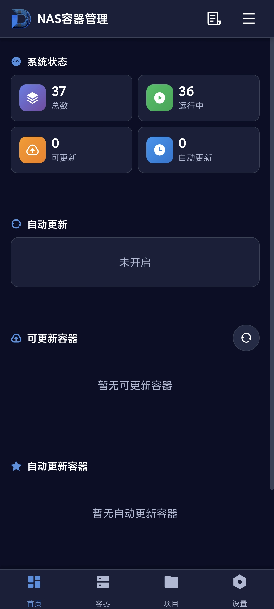
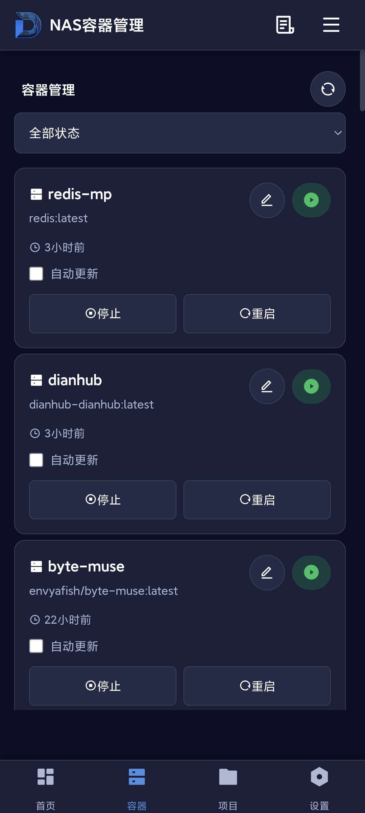
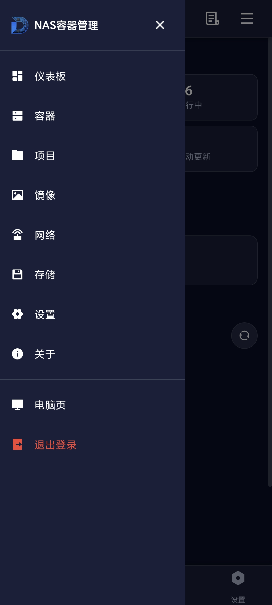

# DIANCUP - Docker与主机管理面板

<div align="center">


**一款功能强大的Docker容器管理与自动更新系统**

[](https://www.docker.com/)
[](https://www.python.org/)
[](LICENSE)

[功能特性](#功能特性) • [快速开始](#快速开始) • [配置说明](#配置说明) • [常见问题](#常见问题) • [联系方式](#联系方式)

</div>

---

- 📧 **TG交流群**：[https://t.me/diancup](https://t.me/diancup)

## 📖 项目介绍

**DIANCUP** 是一款专为NAS用户和Docker爱好者精心打造的现代化容器，服务器管理平台。通过直观友好的Web界面，让您无需深入了解命令行操作也能轻松管理和维护Docker容器服务，为家庭服务器和小型办公环境提供企业级的管理体验。

### ✨ 核心亮点

- 🚀 **智能自动更新** - 自动监控Docker Hub镜像更新，支持灵活的自动更新策略配置
- 🚀 **多设备管理** - **无限制**管理N多设备 不再需要来回切换
- 🖥️ **Web SSH终端** - 集成功能强大的Web终端，支持多标签页管理，随时随地管理服务器
- 📊 **实时监控** - 全面的系统资源监控仪表盘，实时显示CPU、内存、磁盘、网络等关键指标
- 📁 **文件管理** - 内置文件管理器，支持60+种文件格式在线编辑和预览
- 🔔 **企业微信推送** - 支持通过企业微信推送容器状态，远程操作容器功能
- 🎯 **快捷部署** - 内置Docker Compose配置生成器，一键生成标准配置文件

---

## 📸 界面预览

<div align="center">

### 仪表板 - 系统监控

*实时监控系统资源、容器状态和网络流量*

### 容器管理

*一键启停、更新检测、批量操作*

### 文件管理器

*在线编辑、文件预览、权限管理*

### SSH终端

*多标签页Web终端，随时随地管理服务器*
### 昱君探针

*多服务器一键切换管理*

### 移动端适配
<table>
<tr>
<td align="center" width="33%">
<br>
<b>移动端仪表板</b>
</td>
<td align="center" width="33%">
<br>
<b>移动端容器管理</b>
</td>
<td align="center" width="33%">
<br>
<b>移动端导航菜单</b>
</td>
</tr>
</table>

</div>

> 💡 **提示**：截图展示了系统的主要功能界面，实际使用体验更加流畅和强大！

---

## 🎯 功能特性

### 容器管理
- ✅ 容器启动、停止、重启、删除
- ✅ 实时查看容器日志
- ✅ 容器资源使用监控（CPU、内存、网络）
- ✅ 批量操作支持
- ✅ 容器镜像更新检测
- ✅ 自动更新策略配置

### 系统监控
- 📈 实时系统资源监控
- 💾 磁盘使用情况统计
- 🌐 网络流量监控
- 🔍 容器状态统计
- ⏱️ 系统运行时间追踪

### 文件管理
- 📂 完整的文件系统浏览
- ✏️ 支持60+种文件格式在线编辑
- 🖼️ 图片、音视频文件预览
- 📤 文件上传下载
- 🔍 文件搜索功能

### 其他功能
- 🔐 安全的用户认证系统
- 🎨 现代化响应式界面
- 📱 移动端自适应
- 🌙 支持PWA安装
- 🔄 Docker Compose生成器
- ⏰ 定时任务管理

---

## 🚀 快速开始

### 前置要求

- Docker 20.10+
- Docker Compose 2.0+
- 2GB+ 可用内存
- 支持的系统：Linux

### 安装部署

#### 方式：Docker Compose（推荐）

1. **创建项目目录**
```bash
mkdir -p ~/diancup && cd ~/diancup
```

2. **创建 docker-compose.yml 文件**
```yaml
services:
  diancup:
    image: yjnas/diancup:latest
    container_name: diancup
    network_mode: host
    privileged: true                  # 特权模式（必须）
    restart: always
    volumes:
      - ./config:/config              # 配置文件目录（默认相对路径可不修改，也可以修改为绝对路径，部分系统需要确保路径下有config目录）
      - /:/host                       # 主机根目录（不允许修改！）
    environment:
      - DOCKER_DIR=/your/docker/path  # 你的Docker配置目录（必须修改）
      - WEB_PORT=9527                 # Web服务端口（可选修改）
    labels:
      - diancup.self=true #必须，不可更改！
```

> ⚠️ **重要**：请将 `DOCKER_DIR` 修改为你实际的Docker配置目录路径！

3. **启动服务**
```bash
docker-compose up -d
```

4. **访问Web界面**
```
http://your-server-ip:9527
```

默认登录凭据：
- 密码：`admin@yjnas`

> ⚠️ **安全提示**：首次登录后请立即修改默认密码！


## ⚙️ 配置说明

### 环境变量

| 变量名 | 说明 | 示例值 | 必填 |
|--------|------|--------|------|
| `DOCKER_DIR` | 你的Docker配置目录路径 | `/mnt/cache/appdata/docker` | ✅ 是 |
| `WEB_PORT` | Web服务端口 | `9527` | 否 |

#### DOCKER_DIR 配置说明

> ⚠️ **必须配置**：`DOCKER_DIR` 需要设置为你实际的Docker配置目录，不同系统路径不同！

### 目录挂载

| 容器路径 | 说明 | 推荐挂载 | 必填 |
|----------|------|----------|------|
| `/config` | 配置文件和数据库 | `./config` | ✅ 是 |
| `/host` | 主机根目录访问 | `/` | ✅ 是 |

### 特权模式说明

> ⚠️ **重要**：本项目**必须**使用特权模式（`privileged: true`）运行！

**为什么需要特权模式？**

1. **容器管理权限**：通过特权模式直接访问宿主机的Docker守护进程来管理其他容器
2. **文件系统访问**：需要访问宿主机的完整文件系统进行文件管理
3. **系统监控**：需要读取系统级别的资源信息（CPU、内存、磁盘等）
4. **SSH终端功能**：需要执行系统级别的命令和操作

**安全建议：**
- 仅在受信任的网络环境中使用
- 及时修改默认登录密码
- 定期备份配置文件
- 建议配置防火墙规则限制访问IP

### 端口说明

- **9527**：Web管理界面（可通过 `WEB_PORT` 环境变量修改）

---

## 🔧 使用指南

### 容器自动更新配置

1. 进入**容器管理**页面
2. 点击容器卡片**自动开关**
3. 启用/停止**自动更新**
4. 配置更新策略：
   - 检查间隔时间
   - 更新时间窗口
   - 失败重试次数

### SSH终端使用

1. 点击导航栏的 **SSH终端** 按钮
3. 支持多标签页，可同时管理多个会话

### 文件管理

1. 进入**文件管理**页面
2. 浏览文件系统（默认从 `宿主机根目录` 开始）
3. 支持的操作：
   - 上传/下载文件
   - 新建文件/文件夹
   - 重命名/删除
   - 在线编辑（支持60+种格式）
   - 文件预览（图片、视频、音频）

### Docker Compose生成

1. 进入**生成compose**页面
2. 选择容器 → **生成Compose**
3. 系统自动提取容器配置生成标准的 `docker-compose.yml`
4. 可直接复制使用

---
## 更多功能请部署体验！
## 📊 系统要求

### 最低配置
- CPU：1核心
- 内存：1GB
- 磁盘：500MB

### 推荐配置
- CPU：2核心+
- 内存：2GB+
- 磁盘：1GB+

---

## ❓ 常见问题

<details>
<summary><b>Q: 该项目是否收费？</b></summary>

A: 项目完全免费，也没有收费计划。只可能在功能完善无BUG或作者不愿意维护时停止更新。
</details>

<details>
<summary><b>Q: 项目是否开源？</b></summary>

A: 目前项目暂不开源，待功能完善后会考虑开源。
</details>

<details>
<summary><b>Q: 为什么必须使用特权模式？</b></summary>

A: 特权模式是必需的，原因如下：
1. **容器管理**：通过特权模式直接访问宿主机Docker守护进程来管理其他容器
2. **文件管理**：需要访问宿主机完整文件系统
3. **系统监控**：需要读取系统级资源信息
4. **SSH终端**：需要执行系统级命令

特权模式下无需额外挂载 docker.sock，容器可以直接访问宿主机的Docker API。不使用特权模式会导致大部分功能无法正常工作。
</details>

<details>
<summary><b>Q: 容器自动更新失败怎么办？</b></summary>

A: 请检查以下几点：
1. 确认已启用特权模式（`privileged: true`）
2. 确认已挂载主机根目录（`/:/host`）
3. 网络代理设置是否正确
4. 查看容器日志获取详细错误信息
5. 手动拉取镜像测试连接
6. 确认镜像名称和标签是否正确
</details>

<details>
<summary><b>Q: SSH终端无法连接？</b></summary>

A: 请确认：
1. 对应SSH服务已启动
2. 对应度武器防火墙已开放SSH端口（默认22）
3. SSH密码正确
4. 检查账户密码等等信息是否正确
</details>

<details>
<summary><b>Q: 如何备份数据？</b></summary>

A: 在"系统设置"页面，可以导出配置备份文件（`yjnas_backup_YYYYMMDD_HHMMSS.db`），包含所有系统设置。导入时选择备份文件即可恢复配置。
</details>

<details>
<summary><b>Q: 忘记登录密码怎么办？</b></summary>

A: 删除 `config/yjnas.db` 文件，重启容器后会重置为默认密码（admin/admin）。注意：这会清除所有配置！
</details>

<details>
<summary><b>Q: 支持哪些文件的在线编辑？</b></summary>

A: 支持60+种常见文本和代码文件：txt, md, json, xml, yaml, js, py, java, html, css, sh等。图片、音视频文件支持预览播放。
</details>

---

## 🔄 更新日志

### 最新版本

查看容器日志或访问Web界面的**关于**页面查看当前版本信息。

---

## 💬 反馈与支持

### 问题反馈

如遇到BUG或有功能建议，欢迎通过以下方式反馈：

- 📧 **QQ交流群**：[183678380](https://qm.qq.com/q/MbzYnXdaa4)
- 💬 **B站私信**：[@昱君NAS](https://space.bilibili.com/668023659)
- 📝 **博客留言**：[wiki.929722.xyz](https://wiki.929722.xyz)

---

## 🎁 支持项目

如果这个项目对您有帮助，欢迎：

- ⭐ 给项目点个Star
- 📢 分享给更多需要的朋友
- ☕ 请作者喝杯咖啡

<div align="center">

### 打赏支持

<table>
<tr>
<td align="center">
<br>
<b>支付宝</b>
</td>
<td align="center">
<br>
<b>微信</b>
</td>
</tr>
</table>

</div>

## 📄 许可证

本项目为私有项目，未经授权不得用于商业用途。

---

## 👨‍💻 作者

**YJNAS DIAN**

感谢您使用 DIANCUP！如有任何问题或建议，欢迎随时联系。

---

<div align="center">

**Made with ❤️ by YJNAS DIAN**


</div>
<div align="center">

[](https://star-history.com/#yjnas/diancup&Date)

</div>
